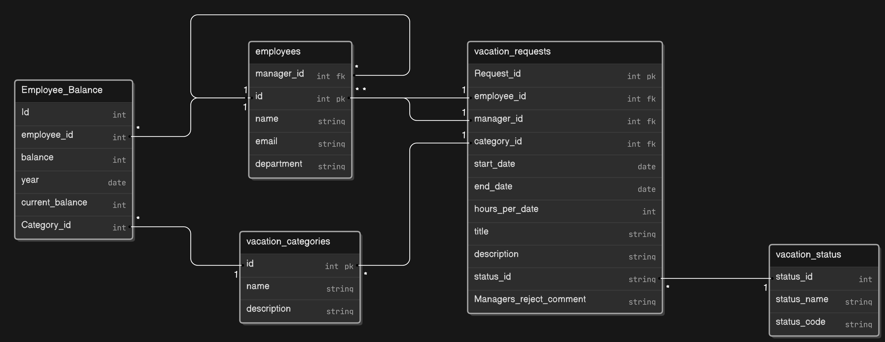

# Vacation Tracking System

**Note:** This project contains diagrams only, with no code implementation.

A Vacation Tracking System (VTS) will provide individual employees with the capability to manage their own vacation time, sick leave, and personal time off, without having to be an expert in company policy or the local facility’s leave policies

# Domain
In the past, all vacation time had to be approved by an immediate manager and then checked by a clerk in the HR department before it was authorized. Sometimes this manual process could take days.

An automated system will:
- Speed up this process and will require at most one manual approval by the immediate manager.
- Streamline the functions of the HR department
- Minimize noncore, business-related activities of management
- Give a sense of empowerment to the employees.
- Save time and money mostly in the HR department

# Functional Requirements
1. Implements a flexible rules-based system for validating and verifying leave time requests.
2. Enables optional manager approval for leave requests.
3. Provides access to requests from the previous calendar year and allows submissions for up to a year and a half in the future.
4. Utilizes email notifications to request manager approval and inform employees of request status changes.
5. Maintains comprehensive activity logs for all transactions.
6. Allows HR and system administrators to override rule-restricted actions, with logging of those overrides.
7. Enables managers to directly award personal leave time within system-set limits.
8. Offers a web service interface for other internal systems to query employee vacation request summaries.
9. Interfaces with legacy HR systems to retrieve necessary employee information and updates.

# Non-Functional Requirements
1. Usability: The system must be user-friendly ,easy to use, intuitive, and intelligent
2. Performance: The system should speed up the vacation approval process, ensuring approvals are completed within X hours/days.
3. Efficiency: the system has the potential to save time and money mostly in the HR department

# Constraints
1. The system uses existing hardware and middleware
2. The system is implemented as an extension to the existing intranet portal system
3. The system uses the portal’s single-sign-on mechanisms for all authentication

# Top-Level Use Case Model

In this system, I focused on one architecturally representative use case: Manage Time, which is the most frequently invoked and most viewed by all the actors of the system .

# Request Vacation Time

## Flow Chart

## Sequence diagram

# Approve Request(manager)

## Flow Chart
 

## Sequence diagram

# Cancel Approved Request

## Flow Chart

## Sequence diagram

# Withdraw Pending Request
## Flow Chart

## Sequence diagram

# Edit Pending Request
## Flow Chart

## Sequence diagram

# Entity Relationship Diagram

a brief explanation of the tables used in the system:
- The Employee Table stores employee information, including their roles 
- The Vacation Categories Table stores information about different Vacation categories (e.g., sick leave, personal leave).
- The Employee balance table shows the balance for an employee per vacation category per year.
- The Vacation Requests is the main table for our system. It includes details about the request, such as vacation dates, and status. It also references the employee and may reference a manager if the request is approved.

# State Machine Diagram

# Lessons Learned
- Creating detailed functional and non-functional requirements helped to clarify the project's scope and objectives.
- Developing a comprehensive domain model allowed for a better understanding of the system's context. This understanding facilitated more effective communication with stakeholders and team members.
- Utilizing UML diagrams (such as use case diagrams, flow charts, etc.) provided a visual representation of system components and their interactions.
- Creating an Entity-Relationship Diagram (ERD) early in the project helped identify relationships and dependencies between data entities. This proactive approach reduces the need for significant changes during implementation.

